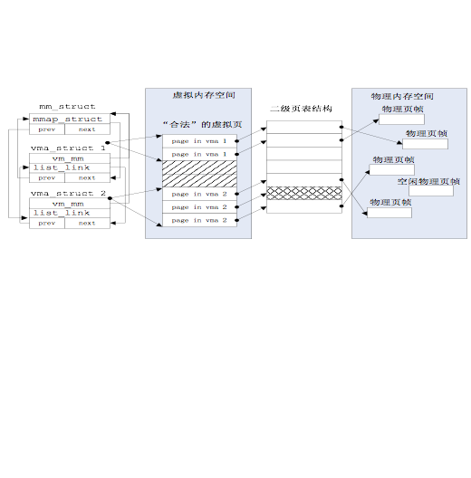

## 虚拟内存管理

###  基本原理概述

什么是虚拟内存？简单地说是指程序员或CPU“看到”的内存。但有几点需要注意：

 1. 虚拟内存单元不一定有实际的物理内存单元对应，即实际的物理内存单元可能不存在；
 2. 如果虚拟内存单元对应有实际的物理内存单元，那二者的地址一般是不相等的；
 3. 通过操作系统实现的某种内存映射可建立虚拟内存与物理内存的对应关系，使得程序员或CPU访问的虚拟内存地址会自动转换为一个物理内存地址。

那么这个“虚拟”的作用或意义在哪里体现呢？在操作系统中，虚拟内存其实包含多个虚拟层次，在不同的层次体现了不同的作用。首先，在有了分页机制后，程序员或CPU“看到”的地址已经不是实际的物理地址了，这已经有一层虚拟化，我们可简称为内存地址虚拟化。有了内存地址虚拟化，我们就可以通过设置页表项来限定软件运行时的访问空间，确保软件运行不越界，完成内存访问保护的功能。

通过内存地址虚拟化，可以使得软件在没有访问某虚拟内存地址时不分配具体的物理内存，而只有在实际访问某虚拟内存地址时，操作系统再动态地分配物理内存，建立虚拟内存到物理内存的页映射关系，这种技术称为按需分页（demand paging）。把不经常访问的数据所占的内存空间临时写到硬盘上，这样可以腾出更多的空闲内存空间给经常访问的数据；当CPU访问到不经常访问的数据时，再把这些数据从硬盘读入到内存中，这种技术称为页换入换出（page　swap in/out），尽管我们LoongArch32版本的uCore中移除了swap功能。这种内存管理技术给了程序员更大的内存“空间”，从而可以让更多的程序在内存中并发运行。

### 实验执行流程概述

本次实验主要完成ucore内核对虚拟内存的管理工作。其总体设计思路还是比较简单，即首先完成初始化虚拟内存管理机制，即需要设置好哪些页需要放在物理内存中，哪些页不需要放在物理内存中，而是可被换出到硬盘上，并涉及完善建立页表映射、页访问异常处理操作等函数实现。然后就执行一组访存测试，看看我们建立的页表项是否能够正确完成虚实地址映射，是否正确描述了虚拟内存页在物理内存中还是在硬盘上，是否能够正确把虚拟内存页在物理内存和硬盘之间进行传递，是否正确实现了页面替换算法等。lab3的总体执行流程如下。

首先是初始化过程。参考ucore总控函数init的代码，可以看到在调用完成虚拟内存初始化的vmm\_init函数之前，需要首先调用setup\_exception\_vector函数和pic\_init函数等，这些工作与lab1的中断异常初始化工作的内容是相同的。接着是调用pmm\_init函数完成物理内存的管理，这也是我们lab2已经完成的内容。

在调用完pmm\_init函数之后，将进一步调用三个lab3中才有的新函数vmm\_init。这个函数涉及了本次实验中的练习2。但需要注意的是，我们需要先实现练习1中的TLB的填充逻辑才能进行vmm\_init。TLB的填充逻辑位于`kern/mm/la32_tlb.c`文件中，这里需要同学们查阅LoongArch32的文档中的“存储管理”章节与“控制状态寄存器”章节，了解LoongArch32的软件填充TLB的基本原理以及CSR中TLB有关寄存器各个位的作用，以实现练习1。

回到ucore的init代码，第一个函数vmm\_init是检查我们的练习1与练习2是否正确实现了。为了表述不在物理内存中的“合法”虚拟页，需要有数据结构来描述这样的页，为此ucore建立了mm\_struct和vma\_struct数据结构（接下来的小节中有进一步详细描述），假定我们已经描述好了这样的“合法”虚拟页，当ucore访问这些“合法”虚拟页时，会由于没有虚实地址映射而产生页访问异常。如果我们正确实现了练习2，则do\_pgfault函数会申请一个空闲物理页，并建立好虚实映射关系，从而使得这样的“合法”虚拟页有实际的物理页帧对应。这样练习1就算完成了。

接下来将进一步分析完成lab3主要注意的关键问题和涉及的关键数据结构。

### 关键数据结构和相关函数分析

对于第一个问题的出现，在于实验二中有关内存的数据结构和相关操作都是直接针对实际存在的资源--物理内存空间的管理，没有从一般应用程序对内存的“需求”考虑，即需要有相关的数据结构和操作来体现一般应用程序对虚拟内存的“需求”。一般应用程序的对虚拟内存的“需求”与物理内存空间的“供给”没有直接的对应关系，ucore是通过page
fault异常处理来间接完成这二者之间的衔接。

page\_fault函数不知道哪些是“合法”的虚拟页，原因是ucore还缺少一定的数据结构来描述这种不在物理内存中的“合法”虚拟页。为此ucore通过建立mm\_struct和vma\_struct数据结构，描述了ucore模拟应用程序运行所需的合法内存空间。当访问内存产生page
fault异常时，可获得访问的内存的方式（读或写）以及具体的虚拟内存地址，这样ucore就可以查询此地址，看是否属于vma\_struct数据结构中描述的合法地址范围中，如果在，则可根据具体情况进行请求调页；如果不在，则报错。mm\_struct和vma\_struct数据结构结合页表表示虚拟地址空间和物理地址空间的示意图如下所示：

图 虚拟地址空间和物理地址空间的示意图

   

在ucore中描述应用程序对虚拟内存“需求”的数据结构是vma\_struct（定义在vmm.h中），以及针对vma\_struct的函数操作。这里把一个vma\_struct结构的变量简称为vma变量。vma\_struct的定义如下：

```c
struct vma_struct {
    // the set of vma using the same PDT
    struct mm_struct *vm_mm;
    uintptr_t vm_start; // start addr of vma
    uintptr_t vm_end; // end addr of vma
    uint32_t vm_flags; // flags of vma
    //linear list link which sorted by start addr of vma
    list_entry_t list_link;
};
```

vm\_start和vm\_end描述了一个连续地址的虚拟内存空间的起始位置和结束位置，这两个值都应该是PGSIZE 对齐的，而且描述的是一个合理的地址空间范围（即严格确保 vm\_start < vm\_end的关系）；list\_link是一个双向链表，按照从小到大的顺序把一系列用vma\_struct表示的虚拟内存空间链接起来，并且还要求这些链起来的vma\_struct应该是不相交的，即vma之间的地址空间无交集；vm\_flags表示了这个虚拟内存空间的属性，目前的属性包括：

```c
#define VM_READ 0x00000001 //只读
#define VM_WRITE 0x00000002 //可读写
#define VM_EXEC 0x00000004 //可执行
```   

vm\_mm是一个指针，指向一个比vma\_struct更高的抽象层次的数据结构mm\_struct，这里把一个mm\_struct结构的变量简称为mm变量。这个数据结构表示了包含所有虚拟内存空间的共同属性，具体定义如下  

```c
struct mm_struct {
    // linear list link which sorted by start addr of vma
    list_entry_t mmap_list;
    // current accessed vma, used for speed purpose
    struct vma_struct *mmap_cache;
    pde_t *pgdir; // the PDT of these vma
    int map_count; // the count of these vma
};
``` 

mmap\_list是双向链表头，链接了所有属于同一页目录表的虚拟内存空间，mmap\_cache是指向当前正在使用的虚拟内存空间，由于操作系统执行的“局部性”原理，当前正在用到的虚拟内存空间在接下来的操作中可能还会用到，这时就不需要查链表，而是直接使用此指针就可找到下一次要用到的虚拟内存空间。由于mmap_cache 的引入，可使得 mm\_struct 数据结构的查询加速 30% 以上。pgdir
所指向的就是 mm\_struct数据结构所维护的页表。通过访问pgdir可以查找某虚拟地址对应的页表项是否存在以及页表项的属性等。map\_count记录mmap\_list 里面链接的 vma\_struct的个数。

涉及vma_struct的操作函数也比较简单，主要包括三个：

* vma_create--创建vma
* insert_vma_struct--插入一个vma
* find_vma--查询vma。

vma\_create函数根据输入参数vm\_start、vm\_end、vm\_flags来创建并初始化描述一个虚拟内存空间的vma\_struct结构变量。insert\_vma\_struct函数完成把一个vma变量按照其空间位置[vma-\>vm\_start,vma-\>vm\_end]从小到大的顺序插入到所属的mm变量中的mmap\_list双向链表中。find\_vma根据输入参数addr和mm变量，查找在mm变量中的mmap\_list双向链表中某个vma包含此addr，即vma-\>vm\_start<=addr <vma-\>end。这三个函数与后续讲到的page fault异常处理有紧密联系。

涉及mm\_struct的操作函数比较简单，只有mm\_create和mm\_destroy两个函数，从字面意思就可以看出是是完成mm\_struct结构的变量创建和删除。在mm\_create中用kmalloc分配了一块空间，所以在mm\_destroy中也要对应进行释放。在ucore运行过程中，会产生描述虚拟内存空间的vma\_struct结构，所以在mm\_destroy中也要进对这些mmap\_list中的vma进行释放。


### TLB Refill例外处理
  
对于LoongArch32架构而言，实现虚存管理的关键在于实现TLB相关的例外处理。其过程中主要涉及到函数 -- handle_tlbmiss的具体实现。在TLB中无法找到的页面，CPU会产生TLB Refill例外，从而设置CSR.PRMD并跳转到TLB Refill例外处理程序开始处理。这个TLB Refill用于完成软件定义页表的实现。在uCore的设计中，我们将TLB Refill例外入口的设置与通用例外入口设置相同，从而可以复用保存现场，设置CRMD、内核栈等代码，然后由trap_dispatch根据读取已经保存的trapframe中的CSR.ESTAT寄存器的值判断是否为TLB Refill相关的例外，若是，则调用`handle_tlbmiss`。


因此，大致的调用关系如下：

> loongarch_trap--\>trap_dispatch--\>handle_tlbmiss

而当`handle_tlbmiss`函数处理时，如果发现对应的PTE不存在，就需要对缺页（Page Fault）进行处理。这里首先调用了`pgfault_handler`函数，进行了相关检查后最终调用到了`do_pgfault`函数，下面需要具体分析一下do\_pgfault函数。do\_pgfault的调用关系如下所示：

> loongarch_trap--\>trap_dispatch--\>handle_tlbmiss--\>pgfault_handler--\>do_pgfault

ucore中do\_pgfault函数是完成页访问异常处理的主要函数，它根据在trapframe中保存的CPU的控制寄存器CSR.BADVA中获取的页访问异常的虚拟地址以及根据errorCode的错误类型来查找此地址是否在某个VMA的地址范围内以及是否满足正确的读写权限，如果在此范围内并且权限也正确，这认为这是一次合法访问，但没有建立虚实对应关系。所以需要分配一个空闲的内存页，并修改页表完成虚地址到物理地址的映射，刷新TLB，然后返回到产生页访问异常的指令处重新执行此指令。如果该虚地址不在某VMA范围内，则认为是一次非法访问。