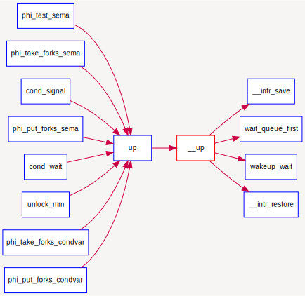

### 信号量 

信号量是一种同步互斥机制的实现，普遍存在于现在的各种操作系统内核里。相对于spinlock
的应用对象，信号量的应用对象是在临界区中运行的时间较长的进程。等待信号量的进程需要睡眠来减少占用
CPU 的开销。参考教科书“Operating Systems Internals and Design
Principles”第五章“同步互斥”中对信号量实现的原理性描述：

```c
struct semaphore {
int count;
queueType queue;
};
void semWait(semaphore s)
{
s.count--;
if (s.count < 0) {
/* place this process in s.queue */;
/* block this process */;
}
}
void semSignal(semaphore s)
{
s.count++;
if (s.count<= 0) {
/* remove a process P from s.queue */;
/* place process P on ready list */;
}
}
```

基于上诉信号量实现可以认为，当多个（\>1）进程可以进行互斥或同步合作时，一个进程会由于无法满足信号量设置的某条件而在某一位置停止，直到它接收到一个特定的信号（表明条件满足了）。为了发信号，需要使用一个称作信号量的特殊变量。为通过信号量s传送信号，信号量的V操作采用进程可执行原语semSignal(s)；为通过信号量s接收信号，信号量的P操作采用进程可执行原语semWait(s)；如果相应的信号仍然没有发送，则进程被阻塞或睡眠，直到发送完为止。

ucore中信号量参照上述原理描述，建立在开关中断机制和wait_queue的基础上进行了具体实现。信号量的数据结构定义如下：

```c
typedef struct {
    int value;                   //信号量的当前值
    wait_queue_t wait_queue;     //信号量对应的等待队列
} semaphore_t;
```

semaphore\_t是最基本的记录型信号量（record
semaphore)结构，包含了用于计数的整数值value，和一个进程等待队列wait\_queue，一个等待的进程会挂在此等待队列上。

在ucore中最重要的信号量操作是P操作函数down(semaphore\_t \*sem)和V操作函数 up(semaphore\_t \*sem)。但这两个函数的具体实现是\_\_down(semaphore\_t \*sem, uint32\_t wait\_state) 函数和\_\_up(semaphore\_t \*sem, uint32\_t wait\_state)函数，二者的具体实现描述如下：

● \_\_down(semaphore\_t \*sem, uint32\_t wait\_state, timer\_t \*timer)：具体实现信号量的P操作，首先关掉中断，然后判断当前信号量的value是否大于0。如果是\>0，则表明可以获得信号量，故让value减一，并打开中断返回即可；如果不是\>0，则表明无法获得信号量，故需要将当前的进程加入到等待队列中，并打开中断，然后运行调度器选择另外一个进程执行。如果被V操作唤醒，则把自身关联的wait从等待队列中删除（此过程需要先关中断，完成后开中断）。具体实现如下所示：

```c
static __noinline uint32_t __down(semaphore_t *sem, uint32_t wait_state) {
    bool intr_flag;
    local_intr_save(intr_flag);
    if (sem->value > 0) {
        sem->value --;
        local_intr_restore(intr_flag);
        return 0;
    }
    wait_t __wait, *wait = &__wait;
    wait_current_set(&(sem->wait_queue), wait, wait_state);
    local_intr_restore(intr_flag);

    schedule();

    local_intr_save(intr_flag);
    wait_current_del(&(sem->wait_queue), wait);
    local_intr_restore(intr_flag);

    if (wait->wakeup_flags != wait_state) {
        return wait->wakeup_flags;
    }
    return 0;
}
```

与`__down`相关的调用和被调用函数关系图如下所示：


● \_\_up(semaphore\_t \*sem, uint32\_t
wait\_state)：具体实现信号量的V操作，首先关中断，如果信号量对应的wait
queue中没有进程在等待，直接把信号量的value加一，然后开中断返回；如果有进程在等待且进程等待的原因是semophore设置的，则调用wakeup\_wait函数将waitqueue中等待的第一个wait删除，且把此wait关联的进程唤醒，最后开中断返回。具体实现如下所示：

```c
static __noinline void __up(semaphore_t *sem, uint32_t wait_state) {
    bool intr_flag;
    local_intr_save(intr_flag);
    {
        wait_t *wait;
        if ((wait = wait_queue_first(&(sem->wait_queue))) == NULL) {
            sem->value ++;
        }
        else {
            wakeup_wait(&(sem->wait_queue), wait, wait_state, 1);
        }
    }
    local_intr_restore(intr_flag);
}
```

与`__up`相关的调用和被调用函数关系图如下所示：



对照信号量的原理性描述和具体实现，可以发现二者在流程上基本一致，只是具体实现采用了关中断的方式保证了对共享资源的互斥访问，通过等待队列让无法获得信号量的进程睡眠等待。另外，我们可以看出信号量的计数器value具有有如下性质：

* value\>0，表示共享资源的空闲数
* vlaue<0，表示该信号量的等待队列里的进程数
* value=0，表示等待队列为空
