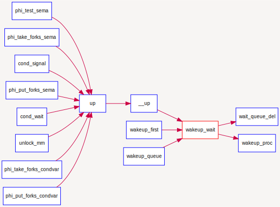
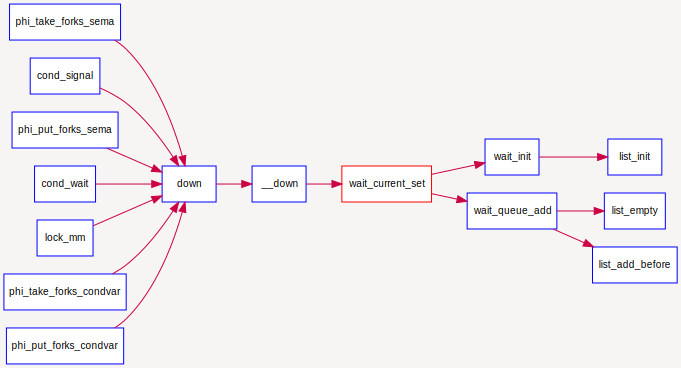

## 同步互斥的底层支撑 

由于有处理器调度的存在，且进程在访问某类资源暂时无法满足的情况下，进程会进入等待状态。这导致了多进程执行时序的不确定性和潜在执行结果的不确定性。为了确保执行结果的正确性，本试验需要设计更加完善的进程等待和互斥的底层支撑机制，确保能正确提供基于信号量和条件变量的同步互斥机制。

根据操作系统原理的知识，我们知道如果没有在硬件级保证读内存-修改值-写回内存的原子性，我们只能通过复杂的软件来实现同步互斥操作。但由于有定时器、屏蔽/使能中断、等待队列wait_queue支持test\_and\_set\_bit等原子操作机器指令（在本次实验中没有用到）的存在，使得我们在实现进程等待、同步互斥上得到了极大的简化。下面将对定时器、屏蔽/使能中断和等待队列进行进一步讲解。

### 定时器 

在传统的操作系统中，定时器是其中一个基础而重要的功能.它提供了基于时间事件的调度机制。在ucore 中，时钟（timer）中断给操作系统提供了有一定间隔的时间事件，操作系统将其作为基本的调度和计时单位（我们记两次时间中断之间的时间间隔为一个时间片，timer splice）。

基于此时间单位，操作系统得以向上提供基于时间点的事件，并实现基于时间长度的睡眠等待和唤醒机制。在每个时钟中断发生时，操作系统产生对应的时间事件。应用程序或者操作系统的其他组件可以以此来构建更复杂和高级的进程管理和调度算法。

* sched.h, sched.c 定义了有关timer的各种相关接口来使用 timer 服务，其中主要包括:
* typedef struct {……} timer\_t: 定义了 timer\_t 的基本结构，其可以用 sched.h 中的timer\_init函数对其进行初始化。
* void timer\_init(timer t \*timer, struct proc\_struct \*proc, int expires): 对某定时器 进行初始化，让它在 expires 时间片之后唤醒 proc
进程。
* void add\_timer(timer t \*timer): 向系统添加某个初始化过的timer\_t，该定时器在 指定时间后被激活，并将对应的进程唤醒至runnable（如果当前进程处在等待状态）。
* void del\_timer(timer\_t \*time): 向系统删除（或者说取消）某一个定时器。该定时器在取消后不会被系统激活并唤醒进程。
* void run\_timer\_list(void): 更新当前系统时间点，遍历当前所有处在系统管理内的定时器，找出所有应该激活的计数器，并激活它们。该过程在且只在每次定时器中断时被调用。在ucore 中，其还会调用调度器事件处理程序。

一个 timer\_t 在系统中的存活周期可以被描述如下：

1. timer\_t 在某个位置被创建和初始化，并通过
add\_timer加入系统管理列表中
2. 系统时间被不断累加，直到 run\_timer\_list 发现该 timer\_t到期。
3. run\_timer\_list更改对应的进程状态，并从系统管理列表中移除该timer\_t。

尽管本次实验并不需要填充定时器相关的代码，但是作为系统重要的组件（同时定时器也是调度器的一个部分），你应该了解其相关机制和在ucore中的实现方法和使用方法。且在trap_dispatch函数中修改之前对时钟中断的处理，使得ucore能够利用定时器提供的功能完成调度和睡眠唤醒等操作。

### 屏蔽与使能中断

根据操作系统原理的知识，我们知道如果没有在硬件级保证读内存-修改值-写回内存的原子性，我们只能通过复杂的软件来实现同步互斥操作，而在内核中，我们必须保证临界区的内存修改不会被中断打断，因此需要操作屏蔽与使能中断。

在ucore中提供的底层机制包括中断屏蔽/使能控制等。kern/sync.c中实现的开关中断的控制函数local\_intr\_save(x)和local\_intr\_restore(x)，它们是基于kern/driver文件下的intr\_enable()、intr\_disable()函数实现的。具体调用关系为：

```c
关中断：local_intr_save --> __intr_save --> intr_disable --> __lcsr_csrxchg(LISA_CSR_CRMD_IE, LISA_CSR_CRMD_IE, LISA_CSR_CRMD)
开中断：local_intr_restore--> __intr_restore --> intr_enable --> __lcsr_csrxchg(0, LISA_CSR_CRMD_IE, LISA_CSR_CRMD)
```

在LoongArch32架构中，中断的开关是通过修改CSR.CRMD寄存器中的IE位来实现的，最终实现了关（屏蔽）中断和开（使能）中断。通过关闭中断，可以防止对当前执行的控制流被其他中断事件处理所打断。既然不能中断，那也就意味着在内核运行的当前进程无法被打断或被重新调度，即实现了对临界区的互斥操作。所以在单处理器情况下，可以通过开关中断实现对临界区的互斥保护，需要互斥的临界区代码的一般写法为：

```c
local_intr_save(intr_flag);
{
  临界区代码
}
local_intr_restore(intr_flag);
……
```

由于目前ucore只实现了对单处理器的支持，所以通过这种方式，就可简单地支撑互斥操作了。在多处理器情况下，这种方法是无法实现互斥的，因为屏蔽了一个CPU的中断，只能阻止本地CPU上的进程不会被中断或调度，并不意味着其他CPU上执行的进程不能执行临界区的代码。所以，开关中断只对单处理器下的互斥操作起作用。在本实验中，开关中断机制是实现信号量等高层同步互斥原语的底层支撑基础之一。

### 等待队列

到目前为止，我们的实验中，用户进程或内核线程还没有睡眠的支持机制。在课程中提到用户进程或内核线程可以转入等待状态以等待某个特定事件（比如睡眠,等待子进程结束,等待信号量等），当该事件发生时这些进程能够被再次唤醒。内核实现这一功能的一个底层支撑机制就是等待队列wait_queue，等待队列和每一个事件（睡眠结束、时钟到达、任务完成、资源可用等）联系起来。需要等待事件的进程在转入休眠状态后插入到等待队列中。当事件发生之后，内核遍历相应等待队列，唤醒休眠的用户进程或内核线程，并设置其状态为就绪状态（PROC_RUNNABLE），并将该进程从等待队列中清除。ucore在kern/sync/{ wait.h, wait.c
}中实现了等待项wait结构和等待队列wait
queue结构以及相关函数），这是实现ucore中的信号量机制和条件变量机制的基础，进入wait
queue的进程会被设为等待状态（PROC_SLEEPING），直到他们被唤醒。

####　数据结构定义
```
typedef  struct {
    struct proc_struct *proc;     //等待进程的指针
    uint32_t wakeup_flags;        //进程被放入等待队列的原因标记
    wait_queue_t *wait_queue;     //指向此wait结构所属于的wait_queue
    list_entry_t wait_link;       //用来组织wait_queue中wait节点的连接
} wait_t;

typedef struct {
    list_entry_t wait_head;       //wait_queue的队头
} wait_queue_t;

le2wait(le, member)               //实现wait_t中成员的指针向wait_t 指针的转化
```

####　相关函数说明
与wait和wait queue相关的函数主要分为两层，底层函数是对wait queue的初始化、插入、删除和查找操作，相关函数如下：

```c
void wait_init(wait_t *wait, struct proc_struct *proc);    //初始化wait结构
bool wait_in_queue(wait_t *wait);                          //wait是否在wait queue中
void wait_queue_init(wait_queue_t *queue);                 //初始化wait_queue结构
void wait_queue_add(wait_queue_t *queue, wait_t *wait);    //把wait前插到wait queue中
void wait_queue_del(wait_queue_t *queue, wait_t *wait);    //从wait queue中删除wait
wait_t *wait_queue_next(wait_queue_t *queue, wait_t *wait);//取得wait的后一个链接指针
wait_t *wait_queue_prev(wait_queue_t *queue, wait_t *wait);//取得wait的前一个链接指针
wait_t *wait_queue_first(wait_queue_t *queue);             //取得wait queue的第一个wait
wait_t *wait_queue_last(wait_queue_t *queue);              //取得wait queue的最后一个wait
bool wait_queue_empty(wait_queue_t *queue);                //wait queue是否为空
```

高层函数基于底层函数实现了让进程进入等待队列--`wait_current_set`，以及从等待队列中唤醒进程--`wakeup_wait`，相关函数如下：

```c
//让wait与进程关联，且让当前进程关联的wait进入等待队列queue，当前进程睡眠
void wait_current_set(wait_queue_t *queue, wait_t *wait, uint32_t wait_state);
//把与当前进程关联的wait从等待队列queue中删除
wait_current_del(queue, wait);
//唤醒与wait关联的进程
void wakeup_wait(wait_queue_t *queue, wait_t *wait, uint32_t wakeup_flags, bool del);
//唤醒等待队列上挂着的第一个wait所关联的进程
void wakeup_first(wait_queue_t *queue, uint32_t wakeup_flags, bool del);
//唤醒等待队列上所有的等待的进程
void wakeup_queue(wait_queue_t *queue, uint32_t wakeup_flags, bool del);
```

### 调用关系举例

如下图所示，对于唤醒进程的函数`wakeup_wait`，可以看到它会被各种信号量的V操作函数`up`调用，并且它会调用`wait_queue_del`函数和`wakup_proc`函数来完成唤醒进程的操作。



如下图所示，而对于让进程进入等待状态的函数`wait_current_set`，可以看到它会被各种信号量的P操作函数｀down`调用，并且它会调用`wait_init`完成对等待项的初始化，并进一步调用`wait_queue_add`来把与要处于等待状态的进程所关联的等待项挂到与信号量绑定的等待队列中。


