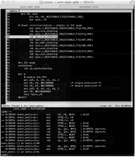

##### 使用gdb配置文件

在上面可以看到，为了进行源码级调试，需要输入较多的东西，很麻烦。为了方便，可以将这些命令存在脚本中，并让gdb在启动的时候自动载入。

以lab0为例，实验根目录下自带了一个`.gdbinit`文件，并输入下面的内容：
```
	target remote 127.0.0.1:1234
	file obj/ucore-kernel-initrd
```
gdb启动的时候会自动加载用户主目录下的.gdbinit文件与当前执行目录下的.gdbinit文件，也可以这样手动载入：
```
	$ gdb -x .gdbinit
```
如果觉得这个命令太长，可以将这个命令存入一个文件中，当作脚本来执行。

另外，如果直接使用上面的命令，那么得到的界面是一个纯命令行的界面，不够直观。



如果想获得上图那样的效果，只需要再加上参数-tui就行了，比如：
```
	gdb -tui -x .gdbinit
```
